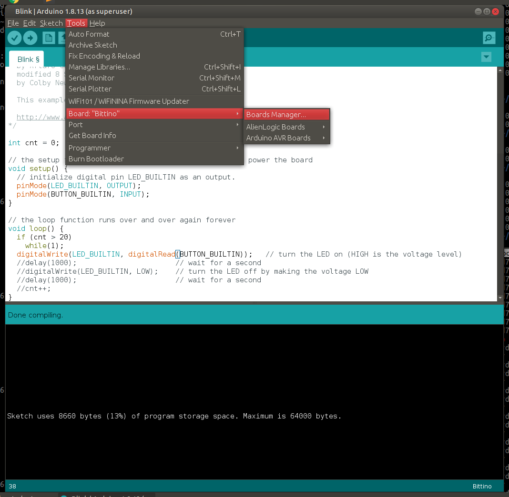

# Bittino_ArduinoIDE

### Installation Instructions

To add board support for Bittino, start Arduino and open the Preferences window (**File** > **Preferences**). Now copy and paste the following URL into the 'Additional Boards Manager URLs' input field:

	https://raw.githubusercontent.com/chmod775/Bittino_ArduinoIDE/master/IDE_BoardManager/package_alienlogic_index.json

If there is already an URL from another manufacturer in that field, click the button at the right end of the field. This will open an editing window allowing you to paste the above URL onto a new line.

Open the Boards Manager window by selecting **Tools** > **Board**, scroll to the top of the board list, and select **Boards Manager**.

And install the Bittino Board by searching **Bittino** into the search field on the top. Click in the desired box, and click the "Install" button that appears. Once installed, the boards will appear at the bottom of the board list.

Now just enjoy your Bittino, and thanks for choosing AlienLogic!
